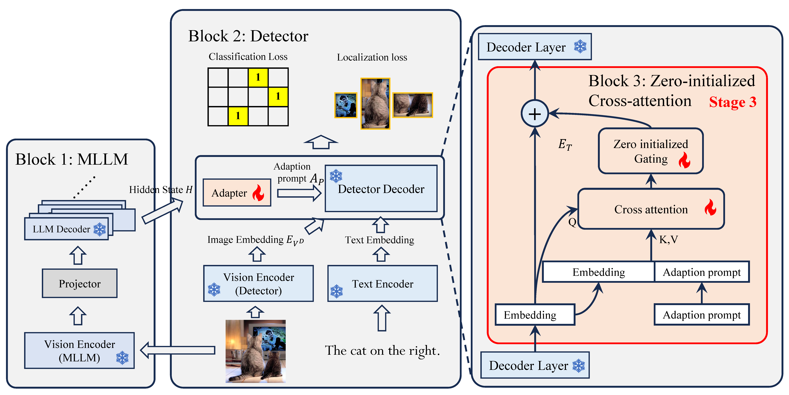

# LED

LED introduces a knowledge‑fusion paradigm for open‑vocabulary object detection: a lightweight adapter directly injects intermediate hidden states from a multimodal large language model (MLLM) into the detector decoder. This removes the need for synthetic data and costly annotations, preserves high‑dimensional pretrained semantics, and strengthens grounding for free‑form text. The approach is model‑agnostic and plugs into mainstream detectors, forming a unified knowledge‑injection pipeline. Systematic studies of layer selection, injection modality, and adapter structure yield effective practices and practical guidelines for deploying LED in real‑world settings.

<p align="center">
  
</p>

---

## 1. Installation 🚀

> Tested on Python 3.9/3.10, CUDA 11.x, PyTorch 2.3, Ubuntu 20.04/22.04.

```bash
# 1. Clone the repo (or place this README in your fork) 🌱
cd GroundingDINO

# 2. Install common Python dependencies 📦
pip install -r requirements.txt

# 3. Build CUDA extensions required by the DINO ops 🧩
cd models/GroundingDINO/ops
python setup.py build install
python test.py   # (optional) sanity‑check GPU kernels ✅
cd ../../..
```

---

## 2. Pre‑trained Weights 🧠

Download the official Swin‑T + OGC checkpoint (≈ 380 MB) 💾:

```bash
wget -P weights/ \
```

Set `--pretrained_path weights/groundingdino_swint_ogc.pth` when launching training or evaluation 🎛️.

---

## 3. Dataset Preparation 📦

### 3.1 The **odvg** Format (Training) 🎯

GroundingDINO can jointly learn from OD (box‑level) and VG (phrase‑level) supervision through a unified JSON‑Lines schema we call **odvg**.


Scripts in **`tools/`** convert popular datasets 🛠️:

| Script 🧾      | Source 🗂️     | Output 📄 |
| -------------- | ------------- | -------- |
| `coco2odvg.py` | COCO (OD)     | `.jsonl` |
| `grit2odvg.py` | GRIT‑20M (VG) | `.jsonl` |
| `lvis2odvg.py` | LVIS (OD)     | `.jsonl` |

```bash
python tools/coco2odvg.py \
  --image-root path/coco_2017/train2017 \
  --anno-file  path/coco_2017/annotations/instances_train2017.json \
  --out-jsonl  path/coco_2017/annotations/coco2017_train_odvg.jsonl
```

Place all generated files and their `*_label_map.json` companions under **`config/dataset_config/`** 📁.

### 3.2 COCO Format (Validation / Testing) 🧪

For now evaluation supports COCO only. Example 📊:

```
path/coco_2017/val2017
└── images & annotations/instances_val2017.json
```

---

## 4. Mixed‑Dataset Configuration ⚙️

Below is a concise example (`mixed_odvg_coco.json`) that feeds six OD/VG sources into *train* and uses COCO *val* for evaluation 📝.

```json
{
  "train": [
    {"root": "path/V3Det/",       "anno": "path/V3Det/annotations/v3det_2023_v1_all_odvg.jsonl",   "label_map": "path/V3Det/annotations/v3det_label_map.json",         "dataset_mode": "odvg"},
    {"root": "path/LVIS/train2017/","anno": "path/LVIS/annotations/lvis_v1_train_odvg.jsonl",        "label_map": "path/LVIS/annotations/lvis_v1_train_label_map.json",   "dataset_mode": "odvg"},
    {"root": "path/Objects365/train/","anno": "path/Objects365/objects365_train_odvg.json",          "label_map": "path/Objects365/objects365_label_map.json",           "dataset_mode": "odvg"},
    {"root": "path/coco_2017/train2017/","anno": "path/coco_2017/annotations/coco2017_train_odvg.jsonl","label_map": "path/coco_2017/annotations/coco2017_label_map.json",    "dataset_mode": "odvg"},
    {"root": "path/GRIT-20M/data/",  "anno": "path/GRIT-20M/anno/grit_odvg_620k.jsonl",             "dataset_mode": "odvg"},
    {"root": "path/flickr30k/images/flickr30k_images/", "anno": "path/flickr30k/annotations/flickr30k_entities_odvg_158k.jsonl", "dataset_mode": "odvg"}
  ],
  "val": [
    {"root": "path/coco_2017/val2017", "anno": "config/instances_val2017.json", "dataset_mode": "coco"}
  ]
}
```

Point the launcher to this file via `--dataset_cfg config/dataset_config/mixed_odvg_coco.json` 🚩.

---


## 5. Quick Start (Full Pipeline) ▶️

```bash
bash train.sh
```


